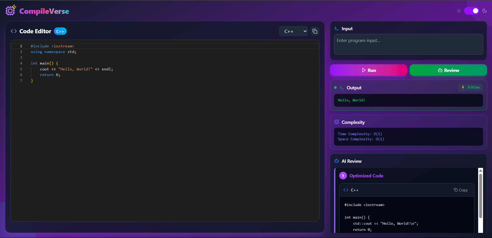

# CompileVerse ✨ - Compile, Analyze, and Optimize with AI

[](https://opensource.org/licenses/MIT)
[](https://reactjs.org/)
[](https://nodejs.org/)
[](https://www.docker.com/)
[](https://aws.amazon.com/)

An advanced online code compiler that not only executes your code but also provides instant Time & Space Complexity analysis and an AI-powered review for code optimization.

---

## 🚀 Live Demo

[**Live Demo**](https://online-compile.vercel.app/)




## 🤔 What is CompileVerse?

In a world full of online code compilers, CompileVerse stands out by focusing on what matters most after getting the correct output: **code efficiency**. It's designed for students, developers, and interview preppers who want to write not just working code, but *optimal* code.

## ✨ Key Features

* **💻 Modern Code Editor**: A beautiful and responsive code editor powered by `@monaco-editor/react`.
* **🌗 Dark & Light Modes**: Seamlessly switch between themes for your comfort.
* **📊 Instant Complexity Analysis**: Run your code and instantly get its **Time and Space Complexity**.
* **🤖 AI Code Review**: Get an **optimized version** of your code and its improved complexity with a single click.
* **🐳 Dockerized Backend**: The backend is containerized with Docker for consistent and scalable deployment.

## 🚧 Deployment Status & Call for Help

* **Frontend**: ✅ The React frontend is successfully deployed and live!
* **Backend**: ⚠️ The Node.js backend has been secured and containerized using **Docker**. The image is ready for cloud deployment.

I am currently facing a challenge with the final step of deploying the backend Docker container to **AWS**. If you have experience with Docker on AWS (using services like **ECR, ECS, or Elastic Beanstalk**) and are willing to help, your guidance would be immensely appreciated! Please open an issue or a pull request.

## 🛠️ Tech Stack

* **Frontend**: React.jsx, Tailwind CSS, @monaco-editor/react
* **Backend**: Node.js, Express.js
* **DevOps**: Docker, AWS
* **AI Integration**: [Mention the AI model/API you used]

## 🚀 Getting Started

To get a local copy up and running, follow these simple steps.

### Prerequisites

* Node.js (v18 or higher)
* Docker
* npm / yarn

### Installation & Setup

1.  **Clone the Repository**
    Open your terminal and run the following command:
    ```sh
    git clone https://github.com/Varni1512/online-compile.git
    cd online-compile
    ```
    ***

2.  **Set Up the Backend (Server)**
    In your first terminal window, navigate to the backend folder and install its dependencies.
    ```sh
    cd backend
    npm install
    ```
    Next, create an environment file to store your API key. In the `backend` directory, create a file named `.env`.
    ```sh
    touch .env
    ```
    Open the `.env` file and add your Google Gemini API key:
    ```env
    GEMINI_API_KEY="YOUR_GEMINI_API_KEY_HERE"
    ```
    Now, start the backend server:
    ```sh
    npx nodemon index.js
    ```
    The server should now be running, typically on port 8080.

    ***

3.  **Set Up the Frontend (Client)**
    **Open a new terminal window or tab.** Navigate to the frontend folder from the project's root directory (`online-compile`).
    ```sh
    cd frontend
    npm install
    ```
    Once the installation is complete, start the frontend development server:
    ```sh
    npm run dev
    ```

    ***

4.  **View the Application**
    Your frontend will now be running and accessible in your web browser, usually at **http://localhost:5173**.

## 🤝 Contributing

Contributions, issues, and feature requests are welcome!

We are **particularly looking for help with deploying our Dockerized backend to AWS**. If you have expertise in this area, please see the "Deployment Status" section above and feel free to reach out.

## 📜 License

Distributed under the MIT License. See `LICENSE` for more information.

## 📬 Contact

LinkedIn - [LinkedIn](http://www.linkedin.com/in/varnikumarpatel)  
Email - varni1505@gmail.com
